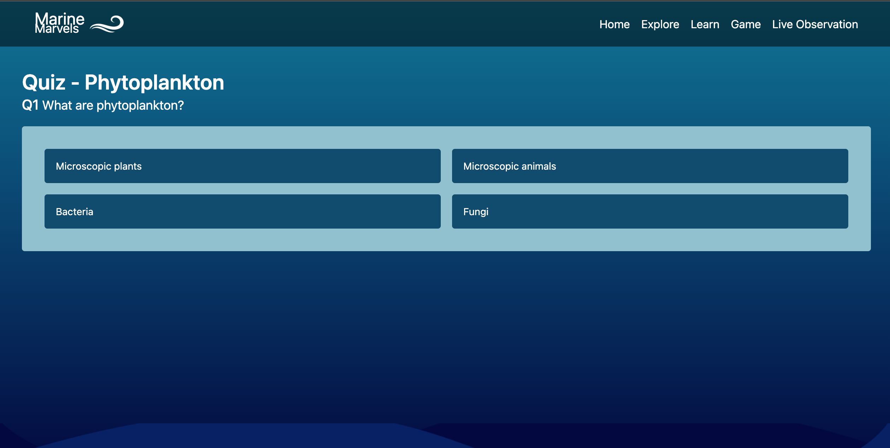

# High Level Project Summary

This immersive 3D interactive learning website is dedicated to unveiling the ocean's essential contributions to our environment. On our platform, delve into the ocean's pivotal role as the planet's life-sustaining garden, where marine photosynthesis generates the very air we breathe, marine phytoplankton combat climate change by lowering atmospheric CO2 levels, and marine ecosystems fuel the food on our plates. Our mission is to make complex scientific concepts easily accessible, fostering a deeper understanding of the ocean's significance in our daily lives. In this exciting adventure anyone can unlock the mysteries of the deep blue and gain a newfound appreciation for the ocean's profound impact on our world.

## 🔗Link to final project

https://github.com/Springhawk27/marine-marvels-nasa-space-apps-challenge-2023

## 🔗Link to Project “Demo”

https://www.youtube.com/watch?v=Z4ArDqL6wJ4

## 🔗Live Web Link

https://marine-marvels.vercel.app/

# Detailed Project Description

Welcome to our comprehensive and captivating website dedicated to unraveling the mysteries of the ocean and its vital contributions to our environment. Our project is not only an educational endeavor but also a tribute to the ocean's profound importance in our lives.

**Home:** Here, we present an overview of our project, delving into the "why" behind our mission. We explain why understanding the ocean is crucial, highlighting how it impacts every facet of our existence, even in landlocked regions. By setting the stage for our exploration, we emphasize the importance of our project in bridging the gap between people and the ocean.

**Explore:** Dive into the depths of the ocean through our stunning 3D visualizations. Embark on an immersive journey to various ocean layers, encountering a diverse array of marine life, from the smallest phytoplankton to the most majestic sea creatures. Our interactive visualizations allow you to explore the ocean's intricate ecosystems like never before.

**Learn:** Knowledge is power, and our "Learn" page is a treasure trove of insights. We break down complex scientific concepts into easily digestible nuggets of wisdom. Discover why phytoplankton are the unsung heroes of our planet, learn about marine food chains, explore Ocean Provided Services, and gain a deeper understanding of the Carbon Cycle, climate change, ocean health, and the wealth of resources the ocean provides. Through engaging videos, animations, and 3D models, we demystify the ocean's workings and draw parallels to a lush garden for relatable comprehension.

**Game:** Learning can be fun, and our exploration game proves just that. Playfully engage with the ocean's role in our environment, unlocking the mysteries and challenges it presents. Test your knowledge and embark on a thrilling adventure that reinforces your understanding of the ocean's significance.

**Live Observation:** We bring the ocean closer to you through real-time Earth observations from NASA's Earth API (EOSDIS). Explore different regions of the ocean and witness its dynamic beauty from the vantage point of satellites. With stunning images courtesy of NASA, you'll gain a newfound appreciation for the vastness and diversity of our oceanic world.

In essence, our entire website is a testament to the wonders of the ocean, using NASA's invaluable resources to inspire and educate. Join us on this enlightening journey to uncover the ocean's secrets and recognize its pivotal role as our planet's life-sustaining garden. Together, we'll foster a deeper connection to the ocean and a commitment to its preservation for generations to come.

## How it works

The website follows a straightforward architecture: it's a user-centric platform with five pages (Home, Explore, Learn, Game, and Live Observation). The primary interaction happens through the website's interface. The unique feature is the Live Observation page, which fetches real-time data from NASA's EOSDIS API, providing users with up-to-date information and imagery. The other pages offer engaging content and experiences related to the ocean's importance and ecosystem, all seamlessly accessible through the website's user-friendly design.

## Features

1. Interactive 3D Visualizations: Explore different ocean layers and marine life interactively.

2. Game Element: Gamified learning to reinforce understanding of ocean contributions.

3. Real-time Data: Live Observation page fetches data from NASA's EOSDIS for current ocean imagery.

4. NASA Resources: Utilizes NASA's resources for imagery and data, ensuring accuracy and reliability.

5. User-friendly Design: Intuitive interface for easy navigation and engagement.

## Solutions

1.Education: Simplifies complex concepts to make ocean science accessible to all users.

2. Engagement: 3D visualizations, interactive games, and multimedia content keep users engaged and interested.

3. Real-time Updates: Live Observation provides up-to-the-minute data, enhancing user experience.

4. Credibility: NASA resources ensure the accuracy and reliability of data and imagery.

5. Ease of Use: User-friendly design and intuitive navigation make the website accessible to a wide audience.

## Tech Stack

- HTML,
- CSS,
- Javascript
- Tailwind CSS
- Next.js
- Node.js
- MongoDb
- Nasa Api

## Resources of NASA and others, and NASA APIs:

1.NASA Ocean Color gallery: https://oceancolor.gsfc.nasa.gov/gallery/

2.NASA Oceanography: https://science.nasa.gov/earth-science/focus-areas/climate-variability-and-change/ocean-physics/oceanography/

3.Protecting Canada’s oceans: https://www.dfo-mpo.gc.ca/oceans/conservation/plan/MCT-OCM-eng.html

4.Ocean Facts: https://oceanservice.noaa.gov/facts/

5.NASA API: Earth Observing System Data and Information System (EOSDIS)

6.NASA API: NASA Image and Video Library(https://images.nasa.gov/docs/images.nasa.gov_api_docs.pdf)

## Hackathon Journey

Our hackathon journey began on our campus, where a group of computer science enthusiasts with diverse tech skills converged with a shared passion for NASA's Space App Challenges. As first-time hackathon participants, We started an exciting journey to solve difficult problems and make our planet a nicer, safer home for everyone. Armed with our combined expertise in CSE, we eagerly embraced the challenge and dove into a world of innovation, coding, and collaboration. With NASA's mission as our inspiration, we navigated sleepless nights, brainstorming sessions, and intense coding marathons. Throughout this journey, we discovered the power of teamwork, resilience, and the incredible potential of technology to solve real-world issues. In the end, our hackathon journey wasn't just about winning; it was about the exhilarating experience of pushing our limits, forging lifelong friendships, and contributing to a brighter future for Earth.

## References

https://oceancolor.gsfc.nasa.gov/gallery/

https://science.nasa.gov/earth-science/focus-areas/climate-variability-and-change/ocean-physics/oceanography/

https://science.nasa.gov/earth-science/focus-areas/climate-variability-and-change/ocean-physics/oceanography/

https://neal.fun/deep-sea/

https://oceanservice.noaa.gov/facts/

## Snaps of the platform

